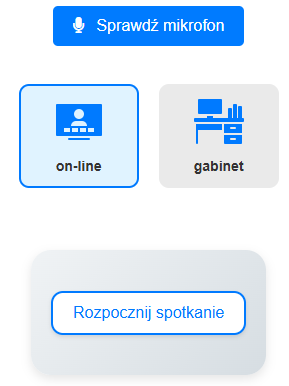

# Wprowadzenie

Witamy w systemie MedFLOW – nowoczesnym narzędziu stworzonym z myślą o usprawnieniu pracy profesjonalistów w dziedzinie medycyny, psychologii, psychoterapii oraz coachingu. Ten rozdział ma na celu przedstawienie ogólnego przeglądu systemu, jego misji oraz kluczowych funkcjonalności, które umożliwiają kompleksowe zarządzanie sesjami, transkrypcjami, raportami i komunikacją z pacjentami.

MedFLOW to kompleksowe rozwiązanie dla specjalistów, które dzięki intuicyjnemu interfejsowi oraz zaawansowanym funkcjom, pomaga skoncentrować się na kluczowych aspektach pracy – relacji z pacjentem oraz efektywnej analizie przeprowadzonych sesji. Rozpoczynając pracę z MedFLOW, zyskujesz narzędzie, które podnosi jakość świadczonych usług oraz ułatwia codzienne zadania administracyjne i dokumentacyjne.

<figure><figcaption></figcaption></figure>
