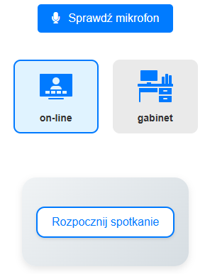

# Konfiguracja Sprzętu Przed Sesją

Aby sesja przebiegała bez zakłóceń, należy upewnić się, że urządzenia audio i wideo są poprawnie skonfigurowane:

* **Testowanie mikrofonu:**
  * Przed rozpoczęciem sesji warto kliknąć przycisk „Sprawdź mikrofon”.
  * Wyświetlone zostaną wskaźniki dźwięku (np. latające słupki), które potwierdzają prawidłowe działanie mikrofonu.
  * W razie potrzeby można wybrać inne dostępne urządzenie z listy, aby uzyskać jak najlepszy sygnał.
* **Konfiguracja sesji online:**

<figure><figcaption></figcaption></figure>

* Po wyborze opcji sesji online, system wyświetli okno umożliwiające wybór ekranu do nagrywania.
* Jeśli użytkownik posiada więcej niż jeden monitor, dostępne będą wszystkie opcje – wybiera się ten ekran, na którym odbywa się spotkanie.
* **Udostępnienie dźwięku z systemu przy spotkaniu on-line:**
  1. Bardzo ważnym elementem jest zaznaczenie opcji „Udostępnij też dźwięk z systemu”, aby system mógł przechwycić wszystkie dźwięki, co zapewnia kompletną rejestrację spotkania.
  2. **Zaznaczamy "Cały ekran"**
  3. **Wybieramy ekran (jeżeli jest jeden, klikamy na ekran)**
  4. **Zaznaczamy "Udostępnij też dzwięk z systemu" - KONIECZNIE!**
  5. **Uaktywni się w tym momencie przycisk :Udostępnij". Klikamy w niego**
  6. **Spotkanie się rozpoczyna.**

<figure><figcaption></figcaption></figure>
